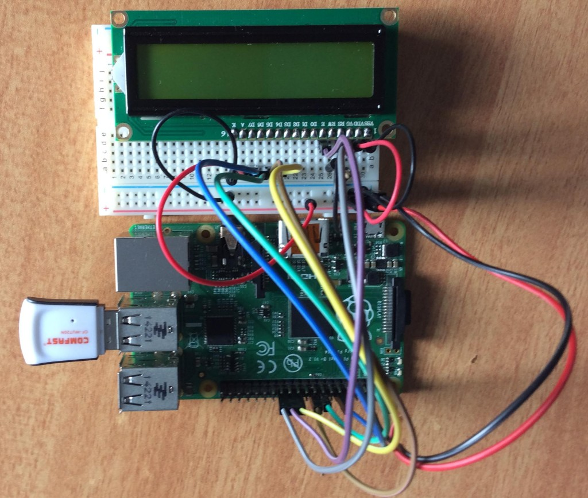
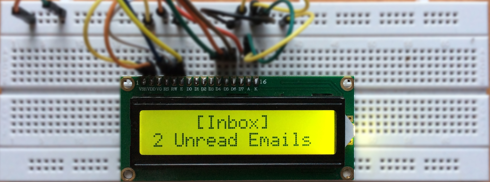

## raspberry_pi_email_notifier

Python script to check email and display them using a 16 X 2 lcd and Raspberry pi

####Bored of checking your emails frequently?

####This might be the perfect solution.

##Requirements

<ul>
  <li>Raspberry Pi</li>
  <li>16 X 2 LCD Display</li>
  <li>16 X 2 LCD Display</li>
  <li>Resistors</li>
  <li>Jumper Wires</li>
  <li>Breadboard</li>
</ul>

##Python Requirements
<ul>
  <li>Feedparser</li>
</ul>
The python script uses the feedparser module to simplify interaction with Gmail

Install Feedparser
  ```bash
  sudo pip install feedparser
  ```
##Wiring
<table>
  <tr>
    <th>LCD PIN</th>
    <th>Function</th>
    <th>Pi Function</th>
    <th>Pi Pin</th>
  </tr>
  <tr>
    <td>01</td>
    <td>GND</td>
    <td>GND</td>
    <td>06</td>
  </tr>
  <tr>
    <td>02</td>
    <td>+5V</td>
    <td>+5V	</td>
    <td>02</td>
  </tr>
  <tr>
    <td>03</td>
    <td>Contrast</td>
    <td>GND</td>
    <td>02</td>
  </tr>
  <tr>
    <td>04</td>
    <td>RS</td>
    <td>GPIO7</td>
    <td>26</td>
  </tr>
  <tr>
    <td>05</td>
    <td>RW</td>
    <td>GND</td>
    <td>02</td>
  </tr>
  <tr>
    <td>06</td>
    <td>E</td>
    <td>GPIO8</td>
    <td>24</td>
  </tr>
  <tr>
    <td>07</td>
    <td>Data 0</td>
    <td></td>
    <td></td>
  </tr>
  <tr>
    <td>08</td>
    <td>Data 1	</td>
    <td></td>
    <td></td>
  </tr>
  <tr>
    <td>09</td>
    <td>Data 2	</td>
    <td></td>
    <td></td>
  </tr>
  <tr>
    <td>10</td>
    <td>Data 3	</td>
    <td></td>
    <td></td>
  </tr>
  <tr>
    <td>11</td>
    <td>Data 4	</td>
    <td>GPIO25	</td>
    <td>22</td>
  </tr>
   <tr>
    <td>12</td>
    <td>Data 5	</td>
    <td>GPIO24	</td>
    <td>18</td>
  </tr>
  <tr>
    <td>13</td>
    <td>Data 6	</td>
    <td>GPIO23	</td>
    <td>16</td>
  </tr>
  <tr>
    <td>14</td>
    <td>Data 7	</td>
    <td>GPIO18</td>
    <td>12</td>
  </tr>
  <tr>
    <td>15</td>
    <td>+5V via 560ohm	</td>
    <td></td>
    <td></td>
  </tr>
  <tr>
    <td>16</td>
    <td>GND	</td>
    <td>GND</td>
    <td>02</td>
  </tr>
</table>

Your circuit should look similar to this



GPIO pinout for reference
<a href="https://www.raspberrypi.org/documentation/usage/gpio-plus-and-raspi2/">GPIO: MODELS A+, B+ AND RASPBERRY PI 2</a>

##Installation
```bash
  $ git clone https://github.com/yogeshojha/raspberry_pi_email_notifier
  $ cd raspberry_pi_email_notifier
```
##Changes to be made
Change the username and password inside email.py
```bash
  $ nano email.py
```
Edit line 10 and 11 with your username and password
```Python
USERNAME = "yourusername@gmail.com"
PASSWORD = "yourpassword"
```

##Usage
```bash
  $ sudo python email.py
```
##Final Output

